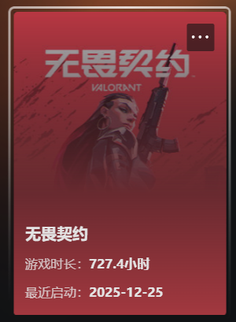

## 目录

1. **产品定位与目标用户（Strategy）**
    
2. **核心玩法与循环**
    
3. **数值与经济系统**
    
4. **商业化与心理博弈（Business）**
    
5. **情感体验与叙事包装（Soul）**
    
6. **主要市场优势**
    
7. **主要不足**
    
8. **策划方案（改良建议）**
    

---

## 1. 产品定位与目标用户（Strategy）

### 1.1 市场定位

- **定位描述：** 英雄战术射击游戏。
    
- **差异化竞争：** 填补了“纯粹写实弹道射击（如CS）”与“高机动技能射击（如守望先锋、APEX）”之间的市场空白。
    

### 1.2 核心竞争力

- **竞技底色：** 极高的竞技公平性。
    
- **技术壁垒：** 标配128 Tick服务器驱动的极低延迟体验。
    
- **硬件适配：** 对中低配置电脑的极致优化，确保大众化普及。
    

### 1.3 目标用户画像

- **核心玩家：** CS系列的老牌硬核FPS玩家，寻求战术策略的变数。
    
- **增长玩家：** 受二次元/美漫风吸引，追求团队竞技成就感的Z世代群体。
    
- **潜在玩家：** 对传统FPS门槛有畏惧感，但愿意通过技能辅助降低对枪压力的休闲玩家。
    

---

## 2. 核心玩法与循环

### 2.1 战术博弈机制

- **技能显性化：** 英雄技能本质上是“战术投掷物的显性化”，分为：信息获取（侦察）、空间限制（烟雾/阻隔）、位置置换（位移）及终结手段（大招）。
    
- **TTK（击杀时长）：** 保持极低TTK，确保核心击杀手段依然是高精度射击（点头），而非技能乱斗。
    
- **地图机制：** 地图采用三路结构或特殊机制点（如传送门），强化资源分配与转场博弈。
    

### 2.2 核心游戏循环

- **局内循环：** 购买阶段 -> 战术对峙 -> 冲突博弈 -> 胜负判定。
    
- **局外循环：** 英雄解锁、战令等级提升、赛季排位成长。
    

---

## 3. 数值与经济系统

### 3.1 局内经济模型

- **信用点（Creds）：** 参考经典经济体系，通过胜负、击杀、埋/拆包获取，确立了强起局、ECO局与长枪局的循环周期。
    
- **技能资源：** 技能作为可购买道具，设定了每回合的使用上限，增加资源管理维度。
    

### 3.2 大招点数系统（Ultimate Points）

- **非线性积累：** 通过击杀、阵亡、吸取能量球、埋/拆包获得。大招不设冷却时间，而是随玩家活跃度增长，鼓励积极对抗。
    

### 3.3 武器数值平衡

- **克制矩阵：** 步枪、狙击枪、冲锋枪与霰弹枪在不同距离下拥有严格的弹道衰减与散布公式，形成稳定的空间博弈。
    

---

## 4. 商业化与心理博弈（Business）

### 4.1 商业逻辑

- **数值零付费：** 保持100%皮肤外观付费，0%数值付费，维护竞技公平。
    

### 4.2 付费驱动因素

- **视听反馈：** 核心付费点在于武器皮肤的VFX（视觉特效）与SFX（音频反馈），满足玩家的表现欲与手感暗示。
    
- **进化系统：** 引入R点（Radianite Points）解锁皮肤特效，利用沉没成本驱动玩家深度参与。
    

### 4.3 销售心理策略

- **轮换商店（Daily Shop）：** 每日随机刷新，利用随机性与稀缺感制造DAU回流。
    
- **夜市（Night Market）：** 限时深度折扣，利用损失厌恶心理转化轻度付费用户。
    

---

## 5. 情感体验与叙事包装（Soul）

### 5.1 视觉与审美

- **竞技可读性：** 采用高对比度、低细节纹理的美术风格，确保竞技环境下玩家轮廓清晰，视觉干扰极少。
    
- **品牌文化：** 融合波普艺术、涂鸦与街头文化，契合Z世代审美潮流。
    

### 5.2 叙事与英雄IP

- **多元化角色：** 英雄拥有对应的母语语音与背景音乐，强化全球本地化认同感。
    
- **世界观设定：** 采用“镜像世界（Omega Earth）”设定，从逻辑上合理解释了相同英雄对战的违和感。
    

### 5.3 反馈反馈设计

- **击杀爽感：** 差异化的击杀反馈与横幅设计，构建了竞技比赛中的多巴胺高光时刻。
    

---

## 6. 主要市场优势

### 6.1 战略缝隙选择

- 精准切入了硬核射击与技能射击的中间地带，同时收割了两类群体的边缘用户。
    

### 6.2 基础基建优势

- 通过128-Tick服务器与全球低延迟网络覆盖，建立了极高的“游戏体验预期”口碑。
    

### 6.3 电竞生态前置

- 研发初期即同步构建VCT职业赛道，邀请前各领域职业选手反馈，自上而下拉动竞技影响力。
    

---

## 7. 主要不足

### 7.1 上手门槛与挫败感

- **操作门槛：** “急停射击”的设定对非FPS硬核玩家极不友好，新手初期难以获得正反馈。
    
- **认知负担：** 几十个英雄的技能、烟位、点位组合，导致新人的信息获取成本呈指数增长。
    

### 7.2 地图与平衡性限制

- **机制僵化：** 部分地图强行捆绑特殊机制，限制了战术的自然演变。
    
- **博弈失衡：** 低分段中部分自导向技能收益远超枪法练习，易导致心理不平衡。
    

### 7.3 商业化摩擦

- **二级货币争议：** R点解锁特效的“二次付费”设计在核心圈层观感较差。
    
- **商店随机性：** 随机槽位导致购买意愿强烈的玩家可能长期刷不出心仪道具。
    

---

## 8. 策划方案（改良建议）

### 8.1 教学与引导优化

- **战术学院模块：** 针对每张地图建立英雄教学关卡（如猎枭探测箭点位引导），将技能使用与射击练习结合。
    
- **智能数据回放：** 提供3D死亡回放，显示受击位置、急停状态及技能覆盖范围，降低学习成本。
    

### 8.2 游戏机制改良

- **动态环境引入：** 增加可被火力或技能破坏的非关键墙体，打破固定的“战术烟位”逻辑。
    
- **愿望清单功能：** 允许玩家标记心仪皮肤，在进入轮换商店时给予通知并微调其随机权重。
    

### 8.3 社区环境治理

- **竞技领袖计划：** 引入手机号或硬件ID锁定的验证队列，辅以严厉的炸鱼判定机制。
    
- **导师系统：** 鼓励高段位玩家带新，并给予专属外观或R点作为声望奖励。
    

### 8.4 娱乐模式拓展

- **创意工坊：** 开放地图编辑器与脚本工具，由社区产出趣味玩法，官方筛选正式引入（如PVE副本或技能融合模式）。