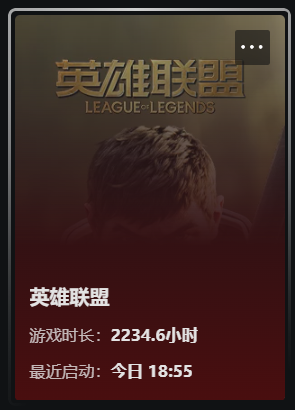

---

# 《英雄联盟》游戏分析报告

---
## 目录

1. 产品定位与目标用户 (The Strategy)
    
2. 核心玩法与循环 (The Loop)
    
3. 数值与经济系统 (The Skeleton)
    
4. 商业化与心理博弈 (The Business)
    
5. 情感体验与叙事包装 (The Soul)
    
6. “海克斯大乱斗”专题分析
    
7. 综合优势与主要不足
    
8. MOBA 的游戏性深度

---

### 1. 产品定位与目标用户 (The Strategy)

- **市场生态位**：LoL 诞生之初旨在抢夺《魔兽争霸 3》Dota 的硬核玩家并将其大众化 。目前处于 MOBA 金字塔中层，比 Dota 2 简单但比《王者荣耀》硬核，是全球 PC 竞技游戏的标杆 。
    
- **用户画像**：
    
    - **核心层**：18-35 岁男性，追求多巴胺激增的竞技快感 。
        
    - **外围层**：IP 粉丝（受《双城之战》影响）及赛事观众（云玩家） 。
        
- **核心逻辑**：通过降低门槛吸引玩家，并通过电竞生态实现稳固运营 。
    
- **商业模式**：非数值付费的极致典范，核心是“皮肤付费+英雄解锁”，不卖属性而卖个性表达与收藏欲望，确保竞技公平 。
    

### 2. 核心玩法与循环 (The Loop)

- **核心逻辑**：基于高频率的正向反馈与不可预测的博弈结果 。
    
- **单局内循环**：对线发育（微操）→ 资源争夺（博弈）→ 团战收割（高潮）→ 摧毁基地（目标） 。
    
- **单局外循环**：获得精萃/经验 → 解锁英雄/成就 → 提升段位（荣誉等级） 。
    
- **操作反馈 (Game Feel)**：响应延迟极低，通过重置平 A 和连招顺滑度形成“丝滑感” 。补刀与击杀的音效反馈极大地刺激了玩家的成就感 。
    
- **核心机制**：英雄差异化（独特的战斗逻辑）与地图资源（大龙、小龙等）驱动，强制玩家产生周期性冲突以解决节奏平衡问题 。
    

### 3. 数值与经济系统 (The Skeleton)

- **核心逻辑**：动态平衡的算法公式，确保滚雪球与翻盘并存 。
    
- **通货膨胀控制**：随着比赛进行动态调整防御塔和击杀赏金，防止一方无限滚雪球，给予落后方翻盘希望 。
    
- **养成线**：单局内养成极快（25-40 分钟满级），单局外养成极长，全英雄收集与熟练度系统支撑了数千小时的游玩时长 。
    
- **货币体系**：严格遵循风险与收益对等，击杀收益 > 助攻 > 补刀 。
    
- **数值深度**：采用乘法计算公式（如护甲减伤），确保数值不会线性溢出，边际效用递减机制为后期团战预留了博弈空间 。
    

### 4. 商业化与心理博弈 (The Business)

- **核心逻辑**：将“付费”转化为“身份认同”，利用社交杠杆获利 。
    
- **付费分层**：
    
    - **白嫖**：提供在线率，作为付费玩家的陪玩和社区基数 。
        
    - **中产**：购买心仪英雄皮肤，追求性价比 。
        
    - **重氪**：追求全皮肤、至臻及限定皮肤，通过稀有度获得社交优越感 。
        
- **运营套路**：
    
    - **海克斯宝箱**：经典的随机激励，利用不确定性诱导小额持续付费 。
        
    - **通行证 (Event Pass)**：利用预付费制劳动和损失厌恶增加留存 。
        

### 5. 情感体验与叙事包装 (The Soul)

- **核心逻辑**：从没有背景的棋子进化为有血有肉的角色 。
    
- **视觉与美术**：从“美式粗犷”向“全球化精致审美”转型，具备独立创造流行文化的能力（如 K/DA 女团） 。
    
- **叙事驱动**：重构符文之地宏大世界观，通过英雄语音、短片及动画让玩家产生稳固的情感联结 。
    
- **社交连接**：强竞技带来情谊与冲突并存，与好友组队开黑是留存率最高的用户行为 。
    

### 6. “海克斯大乱斗”专题分析

- **商业价值**：上线后 LOL 回到 WeGame 周下载榜第一，排位排队迫使服务器扩容 40% 。回流玩家付费意愿更强，成本低于传统广告 。
    
- **设计理念**：契合现代玩家核心需求，包括时间碎片化（平均 18 分钟对局）、无排位积分的低压力娱乐以及解决玩法固化的双重随机机制 。
    
- **核心机制 (可控混乱)**：
    
    - **海克斯强化系统**：强化效果与英雄定位隐性适配（如法师易获法强加成），后期彩强化偏向“翻盘型” 。
        
    - **基础玩法重构**：移除符文系统以降低新手门槛，固定召唤师技能为闪现+雪球 。
        
    - **经济调整**：每 10 秒自动获得 89 金币（比大乱斗多 33%），加速装备成型 。
        
- **玩家体验**：创造了“每局都是新游戏”的体验 。让传统弱势或手短英雄通过海克斯符文获得新的输出流派或安全输出环境 。
    
- **未来发展**：需关注随机性过强导致的体验失衡及新鲜感消退问题 。未来可考虑深度融合 LOL 世界观，联动剧情或开发专属英雄 。
    

### 7. 综合优势与主要不足

- **主要优势**：
    
    - **低门槛与高上限**：取消反补、转身速率等复杂交互 。视觉反馈清晰，职业联赛具有高观赏性 。
        
    - **运营逻辑**：每两周数值微调，每年季前赛大改（如 2025 年鞋子系统），通过人为制造不平衡解决枯燥感 。
        
    - **IP 影响力**：通过全维度降维打击（动画、偶像、音乐等），使退游玩家仍是 IP 消费者 。
        
    - **娱乐模式革新**：大乱斗精准控制在 15-20 分钟，低责任感且极高投入产出比 。
        
- **主要不足**：
    
    - **社交环境**：高度连带责任机制导致负面情绪极易堆积，挫败感是玩家流失的核心原因 。
        
    - **技术限制**：17 年老项目代码积重难返，底层引擎限制创新，英雄重做周期过长 。
        
    - **学习曲线断层**：160 多个英雄及复杂系统使得新玩家入坑难度极高，被称为“49 年入国军” 。
        

### 8. MOBA 的游戏性深度

- **多层级反馈循环**：包括秒级（操作层：补刀特效）、分钟级（资源层：回城更新装备）和局级（策略层：推掉水晶）的反馈 。
    
- **游戏性精髓**：在于战争迷雾下的未知与非对称信息博弈 。5V5 的博弈意味着没有绝对定式，战术重心随装备和经济实时偏移 。
    
- **社交博弈**：
    
    - **责任转移机制**：心理学上允许玩家将失败归咎于队友，作为一种“心理防御机制”让玩家更愿意开启下一局 。
        
    - **协同爽感**：完美的技能 combo 带来的成就感远超单机游戏 。

